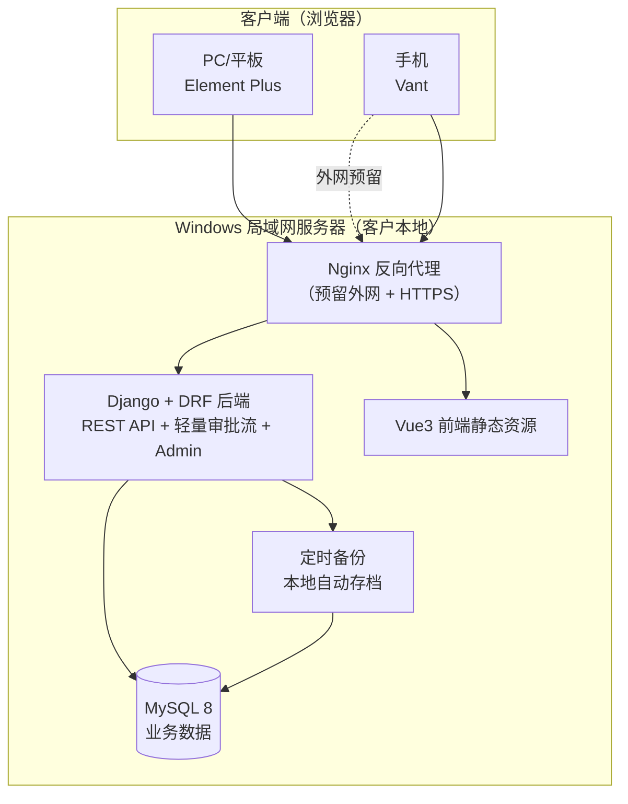
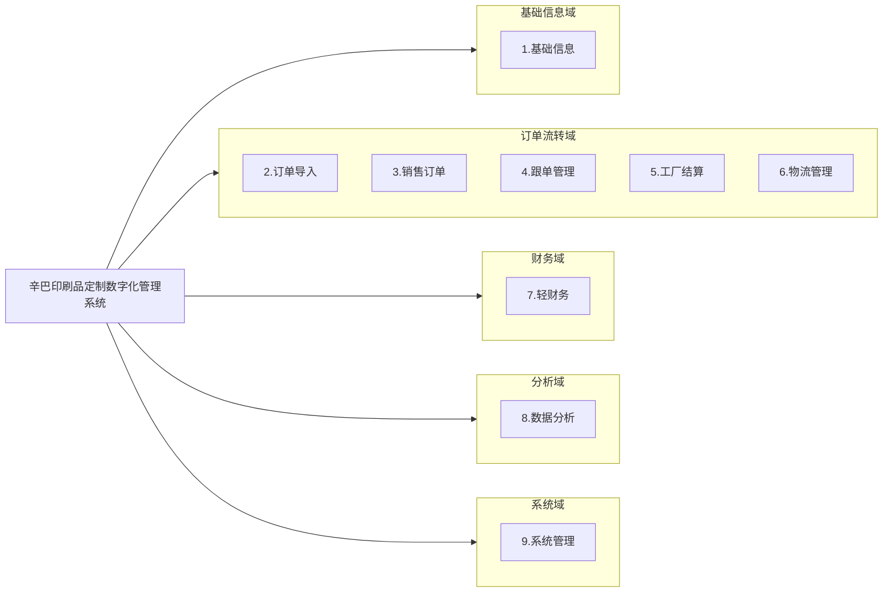
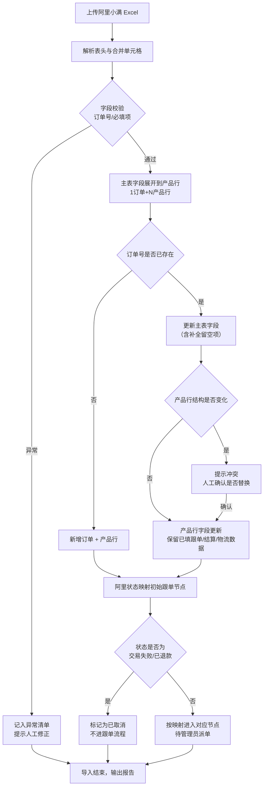
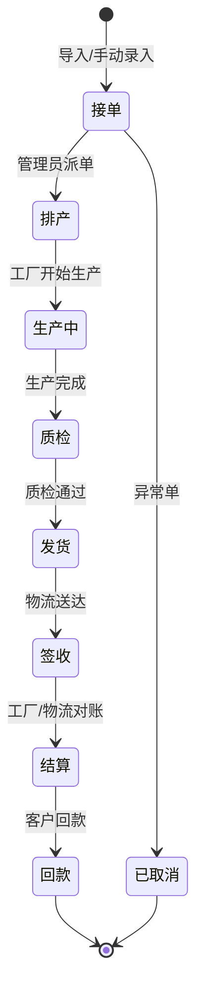
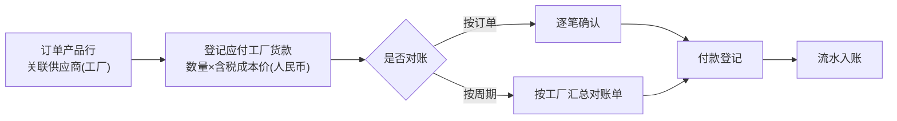
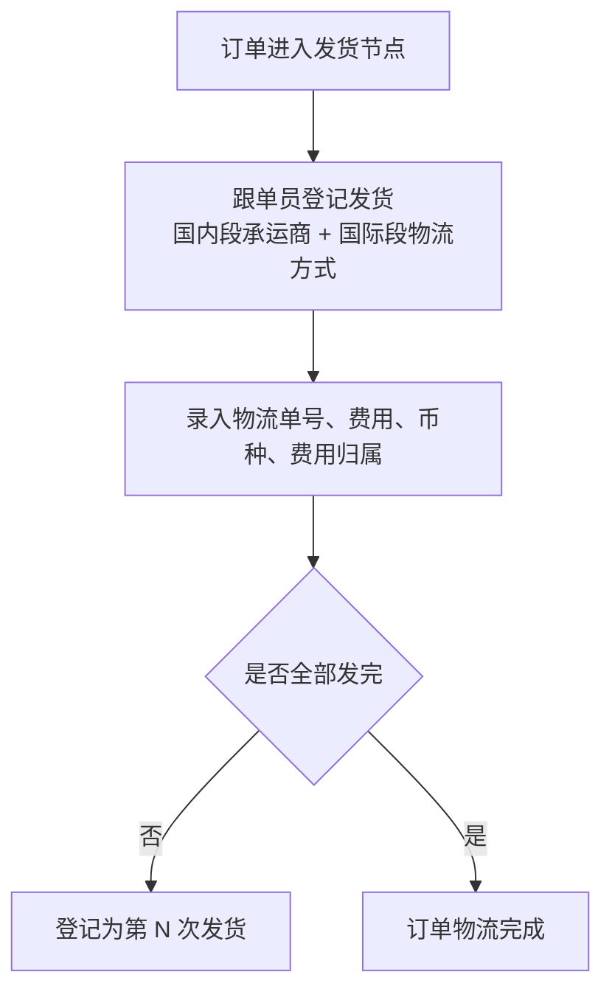
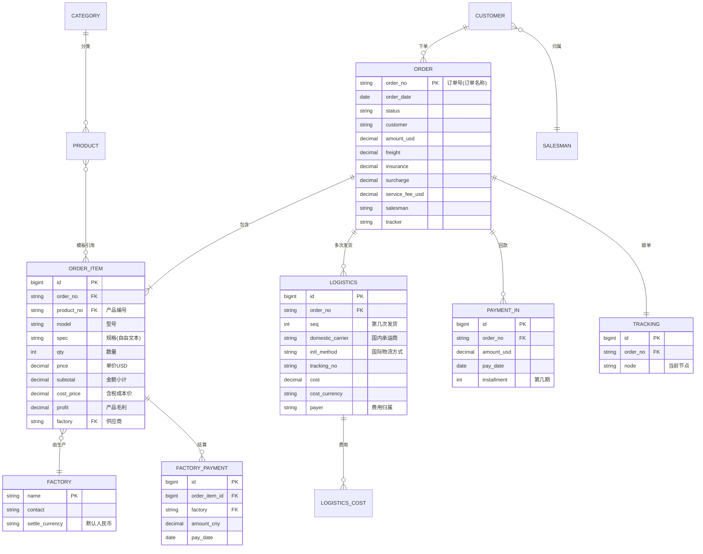

# 辛巴印刷品定制数字化管理系统 · 系统规划文档

> 文档版本：v1.0 ｜ 编制日期：2026-08-12 ｜ 状态：需求对齐稿（待客户确认）

---

## 1. 项目概述

### 1.1 项目背景

客户为一家约 20 人规模的**印刷品定制**企业，核心业务模式为：通过**阿里国际站（阿里小满）承接外贸订单**，将印刷订单**外发给代工厂**生产，再通过**国内 + 国际两段物流**发货至海外客户。

当前业务痛点：
- 订单数据分散在每月导出的 Excel 表中，**无统一沉淀**，跨月查询与统计困难；
- 业务员、跟单员、工厂、物流之间的信息流转**靠口头/微信/表格传递**，进度不透明、易漏单；
- 订单与工厂货款、物流费用的对账**人工核对**，毛利核算滞后且易错；
- 管理层缺乏实时数据看板，经营决策依赖事后手工汇总。

### 1.2 项目目标

建设一套**独立开发、部署在客户本地 Windows 服务器**的 Web 数字化管理系统，实现：

1. **数据统一管理**：订单、产品、工厂、客户、物流等基础与业务数据集中沉淀；
2. **业务流转协同**：业务→跟单→工厂→物流各环节信息在线流转、状态透明、可追溯；
3. **轻财务闭环**：订单关联的收支自动归集，毛利实时可见；
4. **经营数据可视化**：管理层通过仪表盘实时掌握销售、工厂账单、跟单进度与毛利。

### 1.3 适用范围与边界

| 纳入本期（业务协同 + 轻财务） | 不纳入本期 |
|---|---|
| 产品库 / 工厂库 / 类目 / 物流服务商 / 客户-业务员对照 | 完整费控、报销管理 |
| 订单导入与销售订单管理 | 发票管理（仅在订单附件登记单据） |
| 跟单 8 节点流转 | 直连金蝶/用友等外账软件 |
| 工厂结算（按订单-产品行-供应商） | 投标管理、承包合同等工程类模块 |
| 物流账单（两段物流、多次发货） | 人力资源、OA 等非业务模块 |
| 轻财务收支与毛利分析 | — |
| 数据分析仪表盘 | — |

### 1.4 术语表

| 术语 | 含义 |
|---|---|
| 阿里小满 | 阿里国际站的客户管理/订单导出工具，订单 Excel 的来源 |
| 供应商 = 代工厂 | 阿里订单表中的"供应商"列，即承接生产的外协工厂 |
| 承运商 | 国内段物流商（圆通/中通/申通/德邦等） |
| 物流 | 国际发货段物流方式（EMS/DHL/FedEx/UPS/TNT 等） |
| 产品编号 | 产品库唯一标识，参数化模板的主键 |
| upsert | 重复导入时按订单号"存在则更新、不存在则新增" |

---

## 2. 系统总体架构

### 2.1 技术选型

| 层 | 选型 | 选型理由 |
|---|---|---|
| 后端框架 | **Python 3.11 + Django 4 + DRF** | 自带 ORM/Admin/认证/权限，开发快、代码量小、易维护；中小规模系统最省工 |
| 数据库 | **MySQL 8** | 成熟稳定，Windows 部署友好，支持事务与外键约束 |
| 前端框架 | **Vue 3 + Vite** | 主流前端框架，生态成熟，响应式 H5 一套代码三端适配 |
| PC/平板 UI | **Element Plus** | 后台管理组件全（表单/表格/弹窗/树），适合数据密集型界面 |
| 手机端 UI | **Vant** | 移动端组件库，适配跟单员现场记录、老板手机看板场景 |
| 图表 | **ECharts** | 仪表盘饼图/折线图/明细表，支持响应式与主题 |
| 审批流 | **自研轻量审批流** | 线性多级审批，支持驳回/抄送/转交，不引入 Flowable 重型引擎 |
| 部署 | **绿色安装包 + Windows 服务** | 一键安装、开机自启、自动备份，适配无 IT 人员的客户现场 |

### 2.2 系统架构图

### 2.3 部署方案

- **部署形态**：客户准备一台 Windows 10/11 或 Windows Server 的 PC/笔记本**常开当服务器**，接入局域网；20 人通过局域网用浏览器访问（`http://服务器IP:端口`）。
- **纯内网为主**：本期不暴露公网；未来需外网访问时，通过 Nginx 反向代理 + 强制登录 + HTTPS 开放，架构已预留接入点，无需重构。
- **傻瓜化安装**：交付绿色安装包，一键完成 Python 运行时 + MySQL + Nginx + 服务的安装与配置，自动注册 Windows 服务实现**开机自启**，进程异常自动拉起。
- **自动备份**：后台定时任务每日凌晨将 MySQL 数据库导出为 SQL 文件，本地留存最近 30 天备份；备份目录可配置到第二块磁盘以防单盘故障。
- **无 IT 人员适配**：提供"一键启动/停止/备份/恢复"的桌面小工具（或浏览器管理页），无需命令行操作；交付《安装与日常维护手册》图文版。

---

## 3. 角色与权限设计

### 3.1 角色定义

| 角色 | 职责 | 数据可见范围 |
|---|---|---|
| 老板/管理员 | 系统配置、全量数据查看、报表分析 | 全部订单与报表 |
| 业务员 | 录入/导入订单、跟进自有客户订单 | 仅自己名下客户的订单 |
| 跟单员 | 跟进订单进度、工厂对接、物流登记 | 仅派给自己的订单 |
| 财务 | 登记订单相关收支、查看结算报表 | 全部订单的收支与结算数据 |

> 不单设"部门"层（20 人规模扁平，按角色 + 数据可见范围控制即可）。

### 3.2 数据可见范围落地

| 数据范围控制点 | 实现方式 |
|---|---|
| 业务员看自己客户的订单 | 维护"客户 ↔ 业务员"对照表，订单按客户自动归属业务员；新客户导入后手动补派并写入对照表 |
| 跟单员看派给自己的订单 | 订单导入后由管理员/跟单主管手动派单给跟单员 |
| 老板/财务看全量 | 不加数据范围过滤 |

### 3.3 权限矩阵（摘要）

| 功能模块 | 老板/管理员 | 业务员 | 跟单员 | 财务 |
|---|---|---|---|---|
| 基础信息维护 | ✓ | 查看 | 查看 | 查看 |
| 订单导入 | ✓ | ✓ | — | — |
| 订单查看 | 全部 | 本人客户 | 本人跟单 | 全部 |
| 跟单节点推进 | ✓ | — | ✓（本人单） | — |
| 工厂结算登记 | ✓ | — | ✓（本人单） | ✓ |
| 物流账单登记 | ✓ | — | ✓（本人单） | — |
| 收支登记 | ✓ | — | — | ✓ |
| 仪表盘/报表 | 全部 | 本人业绩 | 本人跟单进度 | 收支与结算 |
| 系统配置/用户管理 | ✓ | — | — | — |

---

## 4. 功能模块划分

### 4.1 模块总览

系统按业务域划分为 **9 个模块**。源自报价文件 Sheet1，并按独立开发与实际业务做了重组。

### 4.2 模块 1：基础信息

| 表单 | 功能 | 配置 |
|---|---|---|
| 产品库 | 维护产品参数化模板：产品编号(唯一)、型号、类目、名称、规格(自由文本)、默认单价、默认含税成本价 | 表单 |
| 工厂库 | 维护代工厂信息：工厂名称、联系人、联系方式、结算币种(默认人民币)、备注 | 表单 |
| 类目 | 印刷品品类分类（两级：如 包装类 → 手提袋/纸盒） | 表单 |
| 物流服务商库 | 国内承运商 + 国际物流方式两类维护 | 表单 |
| 客户信息 | 客户台账：客户名/联系人、联系方式、归属业务员 | 表单 |
| 客户-业务员对照 | 客户与业务员映射表，用于订单自动归属 | 表单 |

> 产品库为**参数化模板**而非固定 SKU：印刷品定制规格多变（尺寸/材质/工艺/数量组合），用自由文本规格 + 默认单价即可，避免 SKU 膨胀。产品编号为唯一标识，与阿里订单表的"型号""产品编号"列对应。

### 4.3 模块 2：订单导入

| 表单 | 功能 | 配置 |
|---|---|---|
| 订单导入 | 上传阿里小满导出的统一模板 Excel，自动解析、展开、入库 | 表单 + 自动化 |
| 导入历史 | 记录每次导入的文件、时间、新增/更新/异常订单数 | 表单 |

**导入处理规则**（详见第 5.1 节）：
- 合并单元格**展开存储**为"1 订单 + N 产品行"，查看时**聚合显示**为一张订单；
- 按订单号 **upsert**：主表字段以最新 Excel 更新（含补全上月留空字段），产品行整组替换但**锁定系统内已填的跟单/结算/物流数据**，结构变更提示人工确认；
- 多月文件按订单号**全局去重合并**；
- 阿里状态映射初始跟单节点；**交易失败/已退款标为"已取消"不进跟单**。

### 4.4 模块 3：销售订单

| 表单 | 功能 | 配置 |
|---|---|---|
| 销售订单列表 | 订单台账：订单号、状态、日期、客户、金额(USD)、业务员、跟单员、毛利 | 表单 |
| 销售订单详情 | 订单主表 + 产品明细聚合显示 + 跟单/结算/物流/收支关联信息 | 表单 |
| 订单手动录入 | 小批量新单录入（同导入字段） | 表单 |

### 4.5 模块 4：跟单管理

| 表单 | 功能 | 配置 |
|---|---|---|
| 跟单工作台 | 跟单员待办、在跟订单列表、节点状态 | 表单 |
| 跟单进度 | 8 节点流转记录：每节点跟进文字 + 照片上传 + 时间戳 | 表单 + 流程 |
| 跟单派单 | 管理员将订单派给跟单员 | 表单 + 流程 |

**8 节点**：`接单 → 排产 → 生产中 → 质检 → 发货 → 签收 → 结算 → 回款`

### 4.6 模块 5：工厂结算

| 表单 | 功能 | 配置 |
|---|---|---|
| 工厂结算单 | 按"订单-产品行-供应商"逐笔登记应付工厂货款（人民币） | 表单 + 流程 |
| 工厂对账单 | 按工厂/周期汇总对账 | 表单 |
| 工厂付款登记 | 实际支付款项登记 | 表单 + 流程 |

> 一个订单可对应多个工厂，每个工厂只结算它负责的产品行货款。货款随订单逐笔登记，支持按工厂/周期汇总对账。

### 4.7 模块 6：物流管理

| 表单 | 功能 | 配置 |
|---|---|---|
| 物流账单 | 记录每次发货的物流单：订单号、国内段(承运商)、国际段(物流方式)、单号、费用、币种、归属(客户/公司/工厂付) | 表单 + 流程 |
| 多次发货 | 一个订单可登记多次发货（多张物流单），一张物流单仅对应一个订单 | 表单 |

### 4.8 模块 7：轻财务

| 表单 | 功能 | 配置 |
|---|---|---|
| 客户回款登记 | 订单回款登记（USD，支持分期到账） | 表单 + 流程 |
| 工厂货款登记 | 见模块 5 工厂付款 | 表单 + 流程 |
| 物流费登记 | 见模块 6 物流账单费用 | 表单 + 流程 |
| 服务费登记 | 阿里交易服务费登记（USD） | 表单 |
| 汇率配置 | 手动维护 USD↔人民币汇率，供报表折算 | 表单 |
| 收支流水 | 自动归集所有收支明细 | 表单 |
| 收支导出 | 一键导出 Excel 供会计入外账 | 自动化 |

> 双币种：USD + 人民币。毛利自动计算 = 订单金额(USD) − 工厂货款(折算) − 物流费 − 服务费。发票本期不做，仅在订单附件登记单据扫描件。不直连金蝶/用友。

### 4.9 模块 8：数据分析

| 仪表盘 | 内容 | 配置 |
|---|---|---|
| 销售结算表 | 订单金额、回款、毛利、毛利率，按月/业务员/客户维度 | 仪表盘 |
| 工厂账单汇总 | 各工厂应付/已付货款，按周期对账 | 仪表盘 |
| 跟单信息汇总 | 在跟订单数、各节点停留时长、超期预警 | 仪表盘 |
| 管理人员报表 | 经营总览：销售额、毛利、工厂成本、物流成本、异常订单 | 仪表盘 |

> 各仪表盘含明细表、汇总表、饼状图、折线图，支持按时间/业务员/工厂/客户筛选。

### 4.10 模块 9：系统管理

| 表单 | 功能 | 配置 |
|---|---|---|
| 用户管理 | 账号、角色、启停 | 表单 |
| 角色权限 | 角色与菜单/数据权限配置 | 表单 |
| 审批流配置 | 单据类型绑定多级审核人 | 表单 |
| 操作日志 | 关键操作审计 | 表单 |
| 备份恢复 | 一键备份/恢复数据 | 表单 |

---

## 5. 核心业务流程

### 5.1 订单导入流程

**阿里状态映射表**：

| 阿里状态 | 系统跟单初始节点 | 是否进跟单 |
|---|---|---|
| 待确认 | 接单 | 是 |
| 待发货 | 排产 | 是 |
| 已发货 | 发货 | 是 |
| 交易成功 | 签收 | 是 |
| 交易失败 | — | 否（标记已取消） |
| 已退款 | — | 否（标记已取消） |

### 5.2 订单跟单流转流程

每个节点：跟单员可记录跟进文字、上传照片（生产照/发货照/签收单）、打时间戳。节点可驳回回上一节点。跟单节点由系统内跟单员推进，与阿里状态解耦。

### 5.3 工厂结算流程

### 5.4 物流发货流程

### 5.5 回款流程

---

## 6. 数据模型设计要点

### 6.1 核心实体关系

### 6.2 关键实体说明

| 实体 | 关键设计点 |
|---|---|
| 订单 ORDER | 主键为订单号（阿里订单名称列）；金额 USD；关联业务员/跟单员；阿里状态与系统节点分离存储 |
| 订单明细 ORDER_ITEM | 一个订单 N 行，每行关联一个工厂（供应商）；含成本价与毛利字段；导入时展开生成 |
| 工厂 FACTORY | 即阿里"供应商"；工厂名需规范化（"外部YT/外部XM"等建议在工厂库建别名映射） |
| 物流 LOGISTICS | 一个订单多条记录（多次发货）；区分国内段/国际段；费用记币种与归属 |
| 客户-业务员 | 对照表实现订单自动归属；客户实体复用阿里"联系人"列 |

### 6.3 订单导入与存储模型

导入时按合并单元格展开，**存储层**为扁平的"订单 + 产品行"两表；**展示层**在订单详情时按订单号聚合产品行，还原为一张订单的视觉形态。这样既保证导入数据可逐行关联工厂结算，又保证查看时符合"一单一视图"的习惯。

---

## 7. 关键技术方案

### 7.1 订单导入与合并单元格处理

- 用 `openpyxl` 读取 Excel 并解析合并单元格范围（`ws.merged_cells.ranges`），将主表合并字段（订单状态/日期/金额/承运商等）**下放到该合并范围内的每个产品行**；
- 转换为"订单记录 + 产品行记录"两组数据，分别写入 ORDER 与 ORDER_ITEM 表；
- 字段映射配置化：阿里模板字段 → 系统字段映射表，模板微调时改配置不改代码；
- 异常处理：订单号缺失、必填项为空、产品行无供应商等情况记入异常清单，不阻断整批导入。

### 7.2 双币种与汇率

- 金额字段分币种存储：订单金额/服务费/回款存 USD，工厂货款存人民币，物流费按实际币种存；
- 维护汇率配置表（老板定期填入），报表折算时按"订单日期对应汇率"或"当期汇率"折算展示；
- 不接实时汇率接口（外贸汇率波动+客户手动掌控更可控）。

### 7.3 轻量审批流

- 单据类型（订单/结算/付款/回款）绑定多级审核人配置；
- 支持操作：提交、审核通过、驳回（回发起人）、转交、抄送；
- 审批记录留痕：操作人、时间、意见、节点；
- 不支持可视化拖拽设计、条件分支、会签（20 人规模无需，后续按需扩展）。

### 7.4 数据可见范围控制

- 基于 DRF 权限类实现：业务员查询订单时自动附加 `customer__salesman=当前用户` 过滤；跟单员附加 `tracker=当前用户` 过滤；
- 老板/财务角色不加过滤；
- 导出/打印同样受数据范围约束，防止越权。

### 7.5 自动备份与傻瓜化部署

- **安装包**：将 Python 运行时、MySQL（免安装版）、Nginx、前端 dist、后端代码打包为一个绿色目录 + 安装脚本；
- **Windows 服务**：用 NSSR 将 Django（gunicorn/daphne）与 MySQL 注册为 Windows 服务，开机自启、崩溃自重启；
- **自动备份**：Django 后台定时任务（celery beat 或 cron-like）每日凌晨 `mysqldump` 导出 SQL，滚动保留 30 天；
- **维护小工具**：浏览器管理页提供"启动/停止/立即备份/恢复/查看日志"按钮，无需命令行。

---

## 8. 实施路径与计划

### 8.1 阶段划分

| 阶段 | 内容 | 工期 | 交付物 |
|---|---|---|---|
| 第 1 阶段 | 需求确认 + 系统规划文档（本文档） | 已完成 | 本文档 |
| 第 2 阶段 | 基础信息 + 订单导入 + 销售订单 | 3 周 | 模块 1/2/3 |
| 第 3 阶段 | 跟单管理 + 工厂结算 + 物流管理 | 3 周 | 模块 4/5/6 |
| 第 4 阶段 | 轻财务 + 数据分析仪表盘 | 2 周 | 模块 7/8 |
| 第 5 阶段 | 系统管理 + 审批流 + 权限 + 移动端适配 | 2 周 | 模块 9 + H5 |
| 第 6 阶段 | 联调测试 + 客户现场部署 + 培训 | 2 周 | 部署包+手册 |

> 总工期约 **2.5 个月**（12 周），与原报价"2 个月"基本对齐，独立开发略增 0.5 个月用于部署与移动端适配。

### 8.2 里程碑

- M1（第 3 周末）：订单导入跑通，阿里小满 Excel 可导入并聚合查看；
- M2（第 6 周末）：跟单/工厂/物流全链路打通；
- M3（第 8 周末）：财务闭环 + 仪表盘可看；
- M4（第 10 周末）：移动端可用、权限审批完备；
- M5（第 12 周末）：客户现场上线、培训交付。

### 8.3 交付物清单

1. 系统规划文档（本文档）
2. 系统源代码（前后端）
3. Windows 绿色安装包
4. 《安装与日常维护手册》
5. 《用户操作手册》（分角色）
6. 阿里小满订单导入模板与字段映射说明

---

## 9. 报价复核与建议

### 9.1 原报价复核

报价文件 Sheet1「辛巴精细数字化管理清单」原报价基于**低代码平台（钉钉+中促）搭建**：

| 项目 | 原报价 |
|---|---|
| 定制开发费 | 43,280 元 |
| 平台年费（30 人版） | 5,988 元/年 |
| 首年合计 | 49,268 元 |
| 运维 | 免费 1 年，第 2 年起 2,000 元/年 |

### 9.2 改为独立开发后的成本结构变化

本项目改为**独立开发 + 客户本地部署**后，成本结构发生本质变化：

| 对比项 | 低代码平台方案 | 独立开发方案（本项目） |
|---|---|---|
| 一次性定制费 | 43,280 | 高于低代码（自研全栈开发） |
| 平台年费 | 5,988/年（持续） | **无**（省去） |
| 数据归属 | 平台侧 | **客户本地，完全自主** |
| 定制深度 | 受平台能力限制 | **可深度定制** |
| 运维 | 平台托管 | 客户本地，需傻瓜化+自动备份 |
| 长期成本 | 年费累积 | 一次性 + 运维 |

**建议向客户强调的独立开发价值**：
1. **无持续平台年费**——3 年省下约 1.8 万元年费，长期更省；
2. **数据在客户本地**——外贸订单与客户数据敏感，本地部署更安全可控；
3. **可深度定制**——阿里小满订单导入、双币种毛利、两段物流等业务可量身实现，低代码平台未必顺畅；
4. **可扩展外网**——未来远程访问通过预留的反向代理开放，不依赖平台。

### 9.3 工作量评估与报价建议

基于 9 个模块的功能点估算（详见第 4 节），独立开发总工作量约 **12 周 × 1 名全栈 + 1 名前端**。建议定制开发报价**不低于原 43,280 元**（独立开发工作量与门槛高于低代码搭建），具体金额由商务结合团队成本核定。

### 9.4 风险与提示

| 风险 | 应对 |
|---|---|
| 阿里小满导出模板字段可能调整 | 字段映射配置化，模板微调不改代码 |
| 工厂名称不规范（外部YT/外部XM等） | 工厂库建别名映射，导入时自动归并 |
| 客户无 IT 人员 | 傻瓜化安装包 + 自动备份 + 图文手册 + 远程协助 |
| 双币种汇率波动 | 手动汇率配置，报表折算明示汇率来源 |
| 订单重复导入覆盖误删数据 | upsert 锁定已填数据 + 冲突人工确认机制 |

---

## 10. 附录

### 10.1 阿里小满订单表字段映射

| 阿里表列 | 系统字段 | 存储层级 |
|---|---|---|
| A 订单状态 | 阿里状态（映射跟单初始节点） | 订单 |
| C 订单日期 | order_date | 订单 |
| D 联系人 | customer | 订单 |
| E 订单名称 | order_no（主键） | 订单 |
| F 运费 | freight | 订单 |
| G 物流保险费 | insurance | 订单 |
| H 附加费用 | surcharge | 订单 |
| I 订单金额(USD) | amount_usd | 订单 |
| J 交易服务费(USD) | service_fee_usd | 订单 |
| K 运输成本 | transport_cost | 订单 |
| L 承运商 | domestic_carrier | 订单/物流 |
| M 物流 | intl_method | 订单/物流 |
| N 单号 | tracking_no | 物流 |
| O 备注 | remark | 订单 |
| P 序号 | item_seq | 产品行 |
| Q 供应商 | factory | 产品行 |
| R 数量 | qty | 产品行 |
| S 型号 | model | 产品行 |
| T 产品规格 | spec | 产品行 |
| U 单价 | price | 产品行 |
| V 金额小计 | subtotal | 产品行 |
| W 含税成本价 | cost_price | 产品行 |
| X 产品毛利 | profit | 产品行 |
| Y 毛利润率 | profit_rate | 产品行 |
| Z 产品编号 | product_no | 产品行 |

### 10.2 跟单节点定义

| 节点 | 含义 | 主要操作人 |
|---|---|---|
| 接单 | 订单录入/导入确认 | 业务员/管理员 |
| 排产 | 派单给工厂、安排生产 | 跟单员 |
| 生产中 | 工厂生产进度跟进 | 跟单员 |
| 质检 | 成品质检 | 跟单员 |
| 发货 | 登记物流发货 | 跟单员 |
| 签收 | 客户签收确认 | 跟单员 |
| 结算 | 工厂/物流对账结算 | 跟单员/财务 |
| 回款 | 客户回款核销 | 财务 |

### 10.3 待客户确认事项清单

1. 角色与权限矩阵（第 3.3 节）是否与实际岗位一致；
2. 工厂名称规范化方案（别名映射）的工厂清单；
3. 汇率维护频率与责任人；
4. 移动端是否优先满足跟单员现场录入场景；
5. 部署用服务器的具体配置（CPU/内存/磁盘），用于备份盘规划。

---

*本文档为需求对齐稿，确认后进入第一阶段开发。*